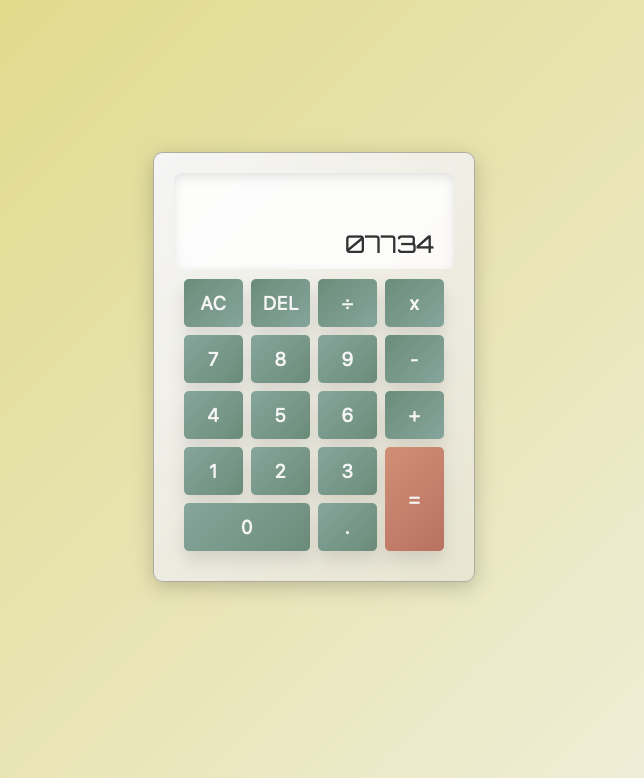

# Calculator

A simple yet elegant calculator built with pure HTML, CSS, and JavaScript. The calculator handles basic arithmetic operations and offers both 
button and keyboard inputs for users.

## Features

- Basic arithmetic operations: Addition, subtraction, multiplication, and division.
- Keyboard input for improved user experience.
- Responsive and intuitive design.
- Protection against division by zero.

